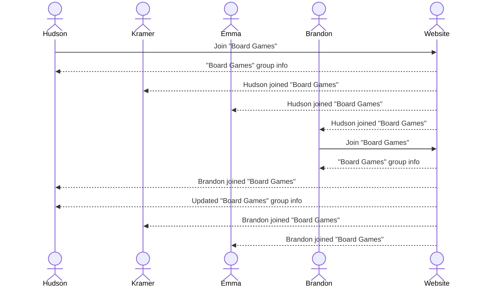

# Eventure

Eventure is an app to meet new people. It could be used as a dating app or just to make new friends. Rather than matching people together, however, you will choose activities. The app will list activities and the users will be able to join activities that interest them, thus matching with people with the same interests.

## 🚀 Specification Deliverable

For this deliverable I did the following. I checked the box `[x]` and added a description for things I completed.

- [x] Proper use of Markdown
- [x] A concise and compelling elevator pitch
- [x] Description of key features
- [x] Description of how you will use each technology
- [x] One or more rough sketches of your application. Images must be embedded in this file using Markdown image references.

### Elevator pitch

Ever want to do something but have no one to do it with? Eventure (event + adventure) is an app to put you in touch with people who like doing the same things as you. Simply pick an activity you want to do and the app will match you with someone else who picked that activity!

### Design

The user will sign in with their full name, their email, and a password.

The user will see a screen with all the activities and will be able to join one.

After joining a group, the user will see the names and emails of the other people in their group to get in contact with.

Here is a sequence diagram showing how the interaction works.

### Key features

- Login, logout, and register
- Join an activity
- Leave an activity
- Displaying how many users are in each activity
- Displaying the other users' contact information in the same activity

### Technologies

I am going to use the required technologies in the following ways.

- **HTML** - Three different screens. Login/Register, joining an activty, and the group information after you've joined.
- **CSS** - Good looking display, with colored buttons and good whitespace usage.
- **React** - Provides login, changes fill number when joined, changes join button to full, allows user to join and leave group.
- **Service** - Endpoints for:
  - login
  - register
  - joining activity group
  - leaving activity group
  - Third party call to verify valid email address
- **DB/Login** - Stores users and groups in database. Database securely stores user login information.
- **WebSocket** - As users join groups, their choice is shown to other users.

## 🚀 AWS deliverable

For this deliverable I did the following. I checked the box `[x]` and added a description for things I completed.

- [x] **Server deployed and accessible with custom domain name** - [My server link](https://hudson-stohl.click).

## 🚀 HTML deliverable

For this deliverable I did the following. I checked the box `[x]` and added a description for things I completed.

- [x] **HTML pages** - There are three HTML pages. The first is for logging in. The second for choosing and joining a group. And the third is for viewing your group or leaving the group.
- [x] **Proper HTML element usage** - I used HTML tags like body, main, header, and footer where appropriate.
- [x] **Links** - The login page automatically links to the choose.html page when signing in. Joining an activity on the choose page links to the joined.html page.
- [x] **Text** - There is text for each activity describing what it is. When an activity is joined, there is text showing who is in your group.
- [x] **3rd party API placeholder** - My 3rd party API will be an email verifier. The placeholder for it is the input box where the user inputs their email.
- [x] **Images** - There is an image of a fun group activity on the joined.html page.
- [x] **Login placeholder** - User can input their name, email, and password. Their name has a place to be displayed on choose.html, and their name is designated with "(you)" on the joined.html page.
- [x] **DB data placeholder** - The program will save the username and password as evidenced by the login vs register buttons. As described earlier, the program will be able to retrieve the users name to display back to them.
- [x] **WebSocket placeholder** - When a person joins a group, the numbers will automatically update on choose.html. When the user is already in a group, they will get updates when another user joins or leaves the group in the chat. The group will be able to chat with one another.

## 🚀 CSS deliverable

For this deliverable I did the following. I checked the box `[x]` and added a description for things I completed.

- [x] **Header, footer, and main content body** - My startup has headers, footers, and main body content.
- [x] **Navigation elements** - I have a good looking navbar at the top of each page leading to the other pages.
- [x] **Responsive to window resizing** - My pages change to fit different screens, shrinking or changing orientation depending on what screen it's displayed on.
- [x] **Application elements** - I used good whitespace and colors.
- [x] **Application text content** - Used a consistent 'Quicksand' font. Colored and weighted text to help readability. People joining is in blue and names are bolded.
- [x] **Application images** - Image scales to the size of the screen, and also bounces in with an animation.

## 🚀 React part 1: Routing deliverable

For this deliverable I did the following. I checked the box `[x]` and added a description for things I completed.

- [x] **Bundled using Vite** - I bundled my startup with Vite.
- [x] **Components** - I moved my html to jsx files that render my pages.
- [x] **Router** - There is routing between my pages and my html is reused where appropriate.

## 🚀 React part 2: Reactivity

For this deliverable I did the following. I checked the box `[x]` and added a description for things I completed.

- [x] **All functionality implemented or mocked out** - My startup has all its functionality or has it mocked out. You can login as a user and it remembers your name. There is a mock to a third-party call to an email verifier. You can join a group and send messages in a chat. Simulated messages will come in as if from other users. The chat is stored in local storage (but one day will be saved to a database) so newcomers in a group can see what was already discussed (simulated messages aren't saved). When you join a group, you can't join another until you leave your old one. The capacity indicators update if you join or leave a group, but simulated users will not affect it.
- [x] **Hooks** - My startup uses useEffect and useState to properly re-render pages when variables change. Used in places such as your username, group name, activity capacity, etc.

## 🚀 Service deliverable

For this deliverable I did the following. I checked the box `[x]` and added a description for things I completed.

- [x] **Node.js/Express HTTP service** - Done!
- [x] **Static middleware for frontend** - Done!
- [x] **Calls to third party endpoints** - In unauthenticated.jsx a third party api is called to verify emails of new users. It checks to see if the email provider is legit or not, not necessarily that the email itself exists.
- [x] **Backend service endpoints** - I have endpoints for all the login/register stuff. I also have endpoints to join and leave activities so it keeps track of capacity and users. It also saves chats so new group members can get caught up on the conversation.
- [x] **Frontend calls service endpoints** - My frontend calls into my backend using fetch.
- [x] **Supports registration, login, logout, and restricted endpoint** - My startup supports registration, login, logout, and restricted endpoints.

## 🚀 DB/Login deliverable

For this deliverable I did the following. I checked the box `[x]` and added a description for things I completed.

- [x] **User registration** - User data is stored in Mongo Database when registering.
- [x] **User login and logout** - User data is checked and updated with Mongo Database when logging in and out.
- [x] **Stores data in MongoDB** - My users are stored in the database. The information for my activities are also stored in my database, as well as chat logs for each group.
- [x] **Stores credentials in MongoDB** - Auth credentials are stored in the database to allow users to be remembered and securely sign in.
- [x] **Restricts functionality based on authentication** - User must be authenticated to use all functionality.

## 🚀 WebSocket deliverable

For this deliverable I did the following. I checked the box `[x]` and added a description for things I completed.

- [ ] **Backend listens for WebSocket connection** - I did not complete this part of the deliverable.
- [ ] **Frontend makes WebSocket connection** - I did not complete this part of the deliverable.
- [ ] **Data sent over WebSocket connection** - I did not complete this part of the deliverable.
- [ ] **WebSocket data displayed** - I did not complete this part of the deliverable.
- [ ] **Application is fully functional** - I did not complete this part of the deliverable.
